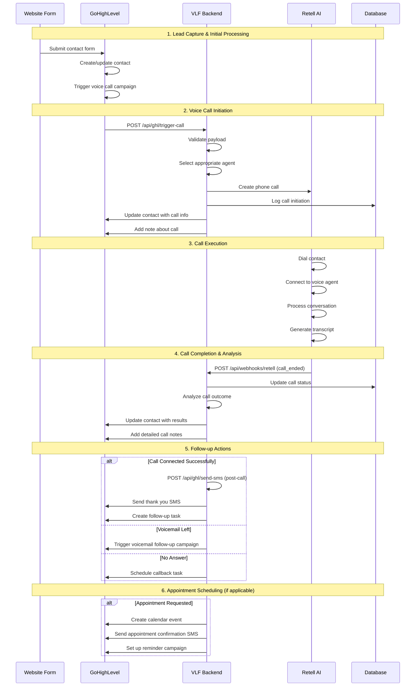
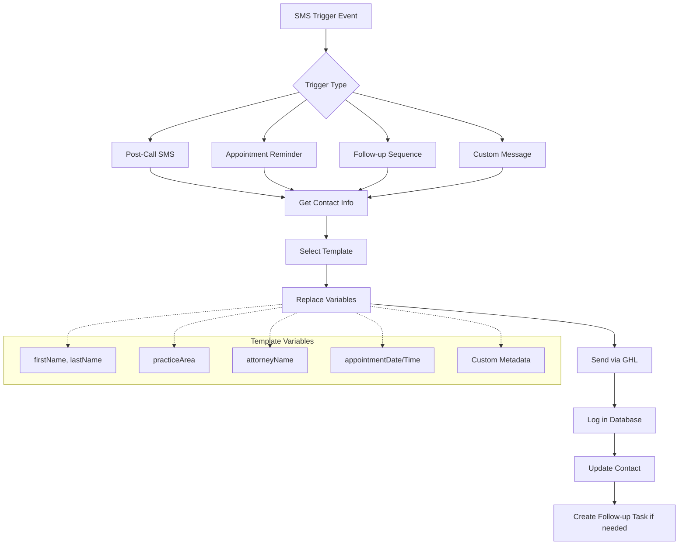
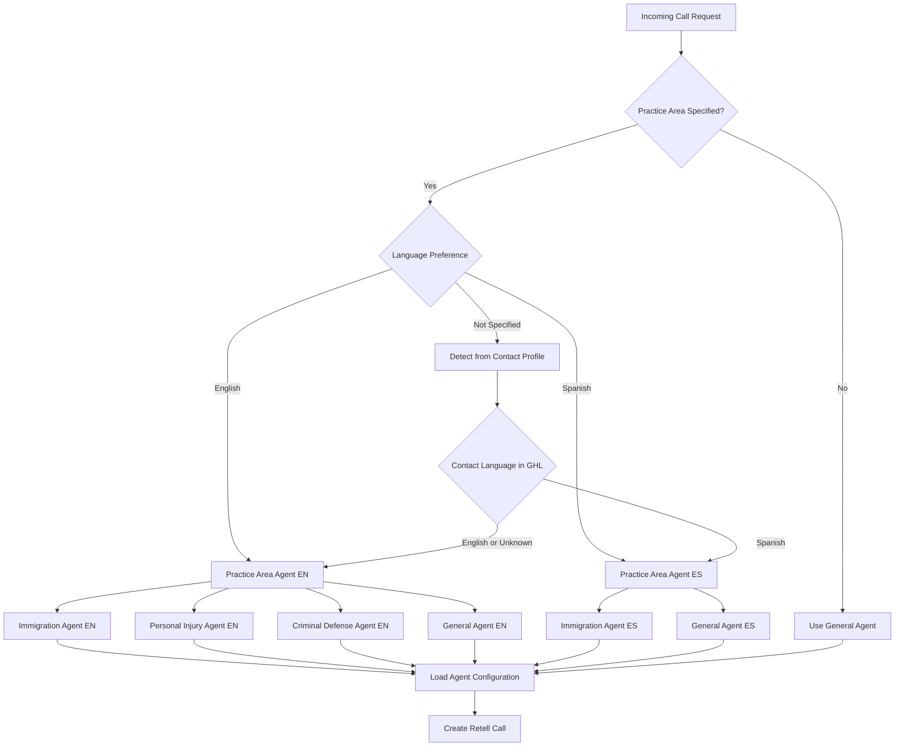
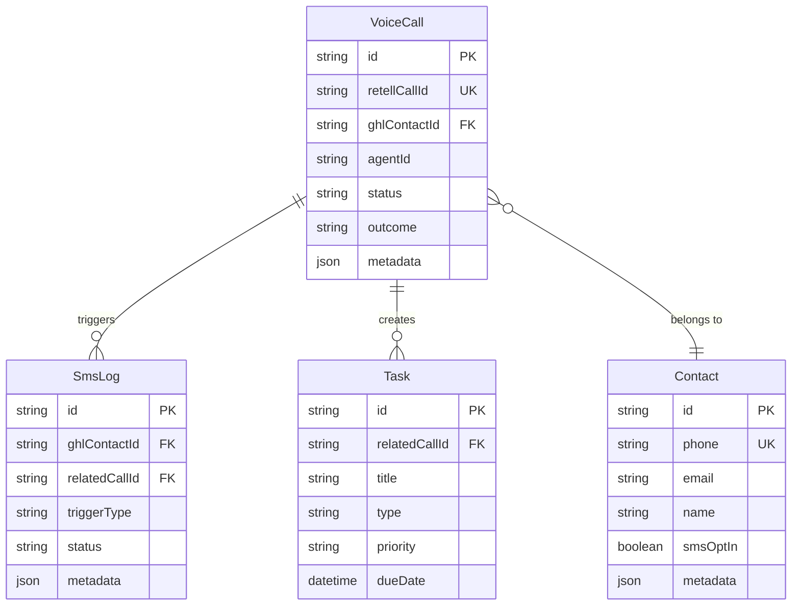
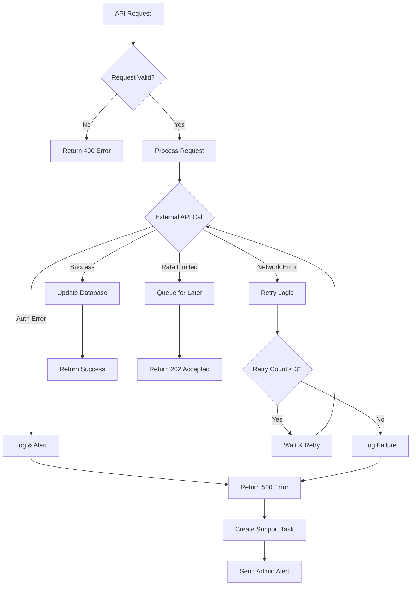
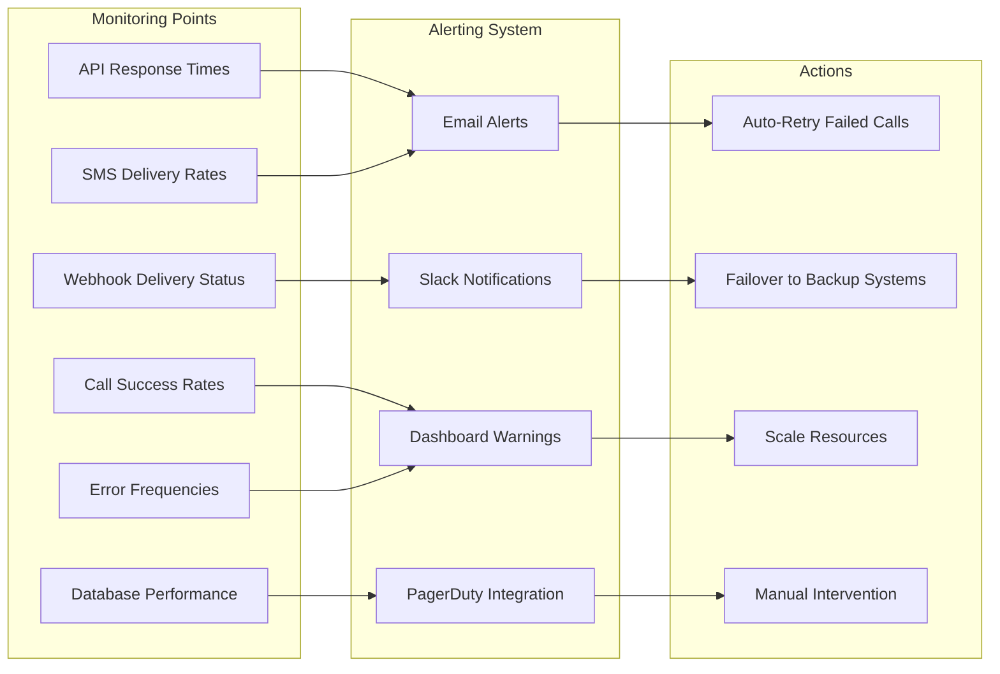
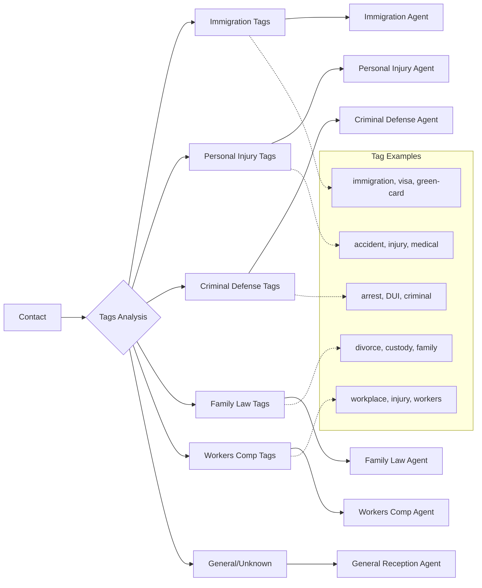
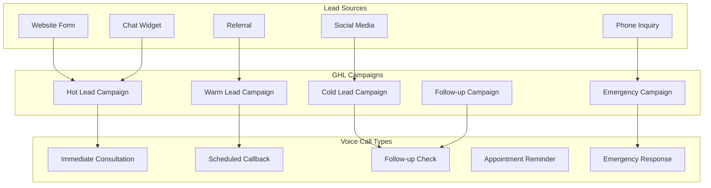

# Retell-GoHighLevel Integration Flow Diagram

## Architecture Overview

```mermaid
graph TB
    subgraph "Website"
        A[Contact Form] --> B[Lead Capture API]
        C[Chat Widget] --> B
        D[Phone Call] --> E[Retell Voice Agent]
    end
    
    subgraph "GoHighLevel"
        F[Contact Database]
        G[Campaigns]
        H[SMS System]
        I[Pipeline Management]
        J[Calendar System]
        K[Task Management]
    end
    
    subgraph "Retell AI"
        L[Voice Agents]
        M[Call Processing]
        N[Speech Recognition]
        O[AI Response Engine]
        P[Call Analytics]
    end
    
    subgraph "VLF Backend"
        Q[GHL Service]
        R[Retell Service]
        S[Database]
        T[Webhook Handlers]
        U[Agent Manager]
    end
    
    subgraph "Integration Endpoints"
        V[/api/ghl/trigger-call]
        W[/api/ghl/send-sms]
        X[/api/webhooks/retell]
        Y[/api/webhooks/ghl]
    end
    
    %% Lead Flow
    B --> F
    F --> G
    G --> V
    
    %% Voice Call Flow
    V --> R
    R --> L
    L --> M
    M --> N
    N --> O
    O --> P
    P --> X
    X --> Q
    Q --> F
    
    %% SMS Flow
    Q --> W
    W --> H
    H --> F
    
    %% Task Creation
    Q --> K
    
    %% Appointment Scheduling
    Q --> J
    
    %% Data Storage
    R --> S
    Q --> S
    T --> S
```

## Detailed Call Flow



## SMS Coordination Flow



## Agent Selection Logic



## Database Interaction Patterns



## Error Handling & Fallbacks



## Integration Health Monitoring



## Practice Area Routing



## Campaign Trigger Mapping



This integration architecture provides a comprehensive solution for connecting GoHighLevel's CRM and campaign management with Retell AI's voice capabilities, creating a seamless flow from lead capture to voice engagement to follow-up automation.