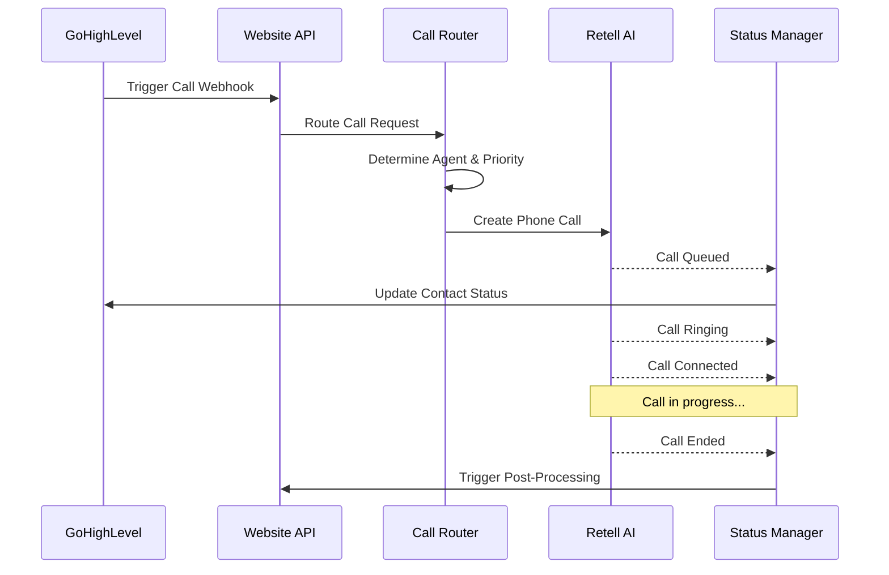
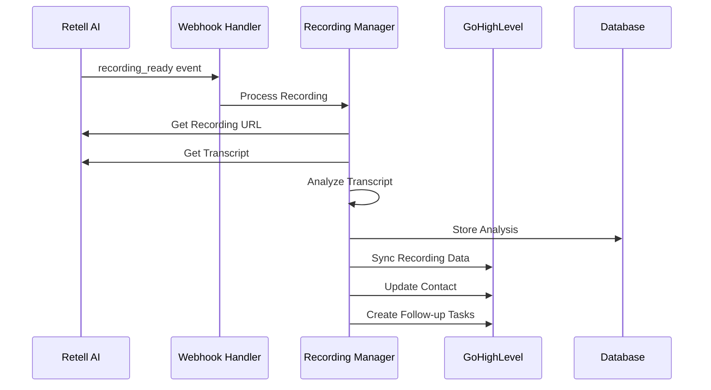

# Retell AI + GoHighLevel Integration Guide

## Overview

This integration connects Retell AI voice agents with GoHighLevel CRM to provide automated voice calling capabilities for Vasquez Law Firm. The system handles call routing, status tracking, recording processing, and seamless data synchronization between platforms.

## Architecture

```
┌─────────────────┐    ┌─────────────────┐    ┌─────────────────┐
│   GoHighLevel   │────│   Website/API   │────│    Retell AI    │
│      CRM        │    │   Integration   │    │  Voice Service  │
└─────────────────┘    └─────────────────┘    └─────────────────┘
         │                       │                       │
         │              ┌─────────────────┐              │
         └──────────────│   Database      │──────────────┘
                        │   PostgreSQL    │
                        └─────────────────┘
```

## Features

### ✅ **Call Routing & Agent Assignment**

- Intelligent routing based on practice area
- Language preference detection (English/Spanish)
- Priority-based queue management
- Existing client recognition and prioritization

### ✅ **Real-time Status Updates**

- Live call status tracking (queued, ringing, connected, ended, failed)
- WebSocket notifications for status changes
- Automatic retry logic for failed calls
- Business hours and urgency handling

### ✅ **Recording & Transcription**

- Automatic call recording processing
- AI-powered transcript analysis
- Sentiment detection and client satisfaction scoring
- Keyword extraction and practice area confirmation

### ✅ **SMS Integration**

- Post-call SMS follow-ups
- Appointment reminders
- No-answer and voicemail follow-ups
- Template-based messaging with personalization

### ✅ **Error Handling & Recovery**

- Comprehensive error classification and handling
- Automatic retry mechanisms
- Admin alerts for critical issues
- Graceful degradation and fallbacks

### ✅ **Security & Authentication**

- Webhook signature verification
- Rate limiting and IP whitelisting
- Input sanitization and validation
- Security event logging and alerting

## Configuration

### Environment Variables

```bash
# Retell AI Configuration
RETELL_API_KEY=2996bc9f-ca4e-422a-b64e-a09a3eaa9bc0
RETELL_WEBHOOK_SECRET=2996bc9f-ca4e-422a-b64e-a09a3eaa9bc0

# GoHighLevel Configuration
GHL_API_KEY=your-ghl-api-key
GHL_LOCATION_ID=your-location-id
GHL_API_URL=https://rest.gohighlevel.com/v1
GHL_WEBHOOK_SECRET=your-webhook-secret

# Phone Numbers
GHL_OUTBOUND_PHONE_NUMBER=+18449673536
GHL_SMS_PHONE_NUMBER=+18449673536

# Campaign IDs (Optional but recommended)
GHL_POST_CALL_SMS_CAMPAIGN_ID=your-campaign-id
GHL_APPOINTMENT_REMINDER_CAMPAIGN_ID=your-campaign-id
GHL_VOICEMAIL_FOLLOWUP_CAMPAIGN_ID=your-campaign-id
GHL_NO_ANSWER_FOLLOWUP_CAMPAIGN_ID=your-campaign-id

# Security Settings
RETELL_CALLS_PER_MINUTE=10
RETELL_CALLS_PER_HOUR=100
RETELL_CALLS_PER_DAY=500
RETELL_IP_WHITELIST=192.168.1.1,10.0.0.1

# Notifications
ADMIN_EMAIL=admin@vasquezlawnc.com
SECURITY_ALERT_EMAIL=security@vasquezlawnc.com
```

## API Endpoints

### 1. Trigger Outbound Call

```http
POST /api/ghl/trigger-call
Content-Type: application/json

{
  "contactId": "ghl-contact-id",
  "contact": {
    "firstName": "John",
    "lastName": "Doe",
    "phone": "+15551234567",
    "email": "john@example.com"
  },
  "practiceArea": "immigration",
  "preferredLanguage": "en",
  "callType": "consultation",
  "metadata": {
    "source": "website",
    "urgency": "high"
  }
}
```

### 2. Send SMS

```http
POST /api/ghl/send-sms
Content-Type: application/json

{
  "contactId": "ghl-contact-id",
  "message": "Thank you for your call today...",
  "triggerType": "post-call",
  "callId": "retell-call-id"
}
```

### 3. Webhook Endpoints

- **Retell Webhooks**: `POST /api/webhooks/retell`
- **GHL Webhooks**: `POST /api/webhooks/ghl`

## Service Components

### Call Router (`call-router.ts`)

Handles intelligent call routing and agent assignment.

```typescript
import { callRouter } from '@/services/retell/call-router';

// Route a call
const { callId, routeDecision } = await callRouter.createRoutedCall({
  phoneNumber: '+15551234567',
  practiceArea: 'immigration',
  language: 'es',
  urgency: 'high',
  sourceType: 'website',
});

// Get routing analytics
const analytics = await callRouter.getRoutingAnalytics({
  start: new Date('2024-01-01'),
  end: new Date('2024-01-31'),
});
```

### Status Manager (`status-manager.ts`)

Manages real-time call status updates and notifications.

```typescript
import { statusManager } from '@/services/retell/status-manager';

// Update call status
await statusManager.updateCallStatus('call-id', 'connected', {
  timestamp: new Date(),
  agent_id: 'agent-123',
});

// Subscribe to status updates
const unsubscribe = statusManager.subscribeToCall('call-id', status => {
  console.log('Status updated:', status);
});

// Get active calls
const activeCalls = statusManager.getActiveCalls();
```

### Recording Manager (`recording-manager.ts`)

Processes call recordings and transcripts with AI analysis.

```typescript
import { recordingManager } from '@/services/retell/recording-manager';

// Process recording
await recordingManager.processRecording('call-id');

// Get recording analytics
const analytics = await recordingManager.getRecordingAnalytics({
  start: new Date('2024-01-01'),
  end: new Date('2024-01-31'),
});

// Get contact recordings
const recordings = await recordingManager.getContactRecordings('ghl-contact-id');
```

### Error Handler (`error-handler.ts`)

Provides comprehensive error handling and recovery.

```typescript
import { retellErrorHandler } from '@/services/retell/error-handler';

// Handle errors
try {
  // ... some operation
} catch (error) {
  await retellErrorHandler.handleError(error, {
    operation: 'create_call',
    callId: 'call-id',
    contactId: 'contact-id',
  });
}

// Get error statistics
const stats = await retellErrorHandler.getErrorStats({
  start: new Date('2024-01-01'),
  end: new Date('2024-01-31'),
});
```

### Security Manager (`security-manager.ts`)

Handles authentication, validation, and security.

```typescript
import { securityManager } from '@/services/retell/security-manager';

// Verify webhook signature
const isValid = securityManager.verifyWebhookSignature(payload, signature);

// Check rate limits
const rateLimit = await securityManager.checkRateLimit('user-id', 'minute');

// Validate phone number
const validation = securityManager.validatePhoneNumber('+15551234567');

// Sanitize metadata
const clean = securityManager.sanitizeMetadata(unsafeData);
```

## Webhook Events

### Retell AI Webhooks

The system handles the following Retell webhook events:

- `call_queued` - Call is queued for processing
- `call_ringing` - Phone is ringing
- `call_started` / `call_connected` - Call connected
- `call_ended` - Call completed
- `call_failed` - Call failed
- `call_no_answer` - No answer
- `call_busy` - Phone busy
- `voicemail_detected` - Voicemail detected
- `transcript_ready` - Transcript available
- `recording_ready` - Recording available
- `call_analyzed` - AI analysis complete

### GoHighLevel Webhooks

- `ContactCreate` - New contact created
- `ContactUpdate` - Contact updated
- `InboundMessage` - SMS/chat message received
- `CampaignCompleted` - Campaign workflow completed

## Call Flow

### 1. Outbound Call Initiation



### 2. Recording Processing



## Practice Area Agents

The system includes specialized agents for different practice areas:

### English Agents

- **General Reception** - Routes calls and provides general information
- **Immigration Law** - Handles immigration-related inquiries
- **Personal Injury** - Assists with accident and injury cases
- **Criminal Defense** - Helps with criminal charges and DUI cases
- **Workers' Compensation** - Handles workplace injury claims

### Spanish Agents

- **Asistente de Inmigración** - Spanish immigration assistance
- _Other practice areas can be configured with Spanish agents as needed_

### Agent Selection Logic

1. Check contact's preferred language
2. Match practice area from contact data or call metadata
3. Consider urgency and client status
4. Fallback to general agent if specific agent unavailable

## Call Priority System

### Priority Levels (1-10)

- **1-3**: Low priority (general inquiries, non-urgent)
- **4-6**: Medium priority (potential clients, follow-ups)
- **7-9**: High priority (existing clients, urgent matters)
- **10**: Emergency (active client emergencies, court deadlines)

### Priority Factors

- **Client Status**: Active clients get +3 priority
- **Urgency Keywords**: "emergency", "urgent", "deadline" increase priority
- **Practice Area**: Criminal defense gets higher priority due to time sensitivity
- **Call History**: Multiple recent calls increase priority
- **Business Hours**: After-hours calls get moderate priority boost

## SMS Integration

### Template System

The system includes pre-defined SMS templates for various scenarios:

#### Post-Call SMS

```
Thank you for speaking with Vasquez Law Firm today. We're here to help with your {{practiceArea}} case. If you have any questions, reply to this message or call 1-844-YO-PELEO.
```

#### Appointment Reminder

```
Reminder: Your appointment with {{attorneyName}} is scheduled for {{date}} at {{time}}. Reply CONFIRM to confirm or call 1-844-YO-PELEO to reschedule.
```

#### Follow-up SMS

```
Hi {{firstName}}, following up on our recent conversation about your {{practiceArea}} case. Do you have any questions or would you like to schedule a consultation? Reply or call 1-844-YO-PELEO.
```

### SMS Keyword Handling

- `STOP`, `UNSUBSCRIBE`, `CANCEL` - Opt out of SMS
- `START`, `SUBSCRIBE`, `YES` - Opt in to SMS
- `CONFIRM` - Confirm appointment
- Custom keywords trigger appropriate responses

## Analytics & Reporting

### Call Analytics

```typescript
// Get routing analytics
const routingStats = await callRouter.getRoutingAnalytics();

// Get recording analytics
const recordingStats = await recordingManager.getRecordingAnalytics();

// Get status analytics
const statusStats = await statusManager.getStatusAnalytics();

// Get error statistics
const errorStats = await retellErrorHandler.getErrorStats();

// Get security statistics
const securityStats = await securityManager.getSecurityStats();
```

### Available Metrics

- **Call Volume**: Total calls, by practice area, by time period
- **Success Rates**: Connection rates, completion rates
- **Sentiment Analysis**: Positive/negative/neutral distribution
- **Agent Performance**: Calls handled, average duration
- **Conversion Metrics**: Appointments scheduled, follow-ups required
- **Error Rates**: By type, frequency, resolution time
- **Security Events**: Failed authentications, rate limit hits

## Error Handling

### Error Types

- **AUTHENTICATION** - API key issues
- **RATE_LIMIT** - Too many requests
- **AGENT_UNAVAILABLE** - No agents available
- **CALL_FAILED** - Call connection issues
- **INVALID_PHONE** - Invalid phone numbers
- **INSUFFICIENT_BALANCE** - Account balance low
- **NETWORK_ERROR** - Connection problems

### Recovery Mechanisms

- **Automatic Retry** - For transient errors
- **Agent Fallback** - Switch to general agent if specialized unavailable
- **Manual Callback** - Create tasks for failed calls
- **Admin Alerts** - Notify administrators of critical issues
- **Campaign Triggers** - Activate follow-up campaigns

## Security Features

### Authentication

- API key validation for all requests
- Webhook signature verification using HMAC-SHA256
- Origin validation for web requests

### Rate Limiting

- Configurable limits per minute/hour/day
- Per-user and global rate limiting
- Automatic blocking of excessive requests

### Input Validation

- Phone number format validation
- Metadata sanitization (XSS prevention)
- Request size limits

### Monitoring

- Security event logging
- Failed authentication tracking
- Suspicious activity detection
- Real-time alerts for security incidents

## Deployment

### Prerequisites

- Node.js 18+
- PostgreSQL database
- Redis (for caching and rate limiting)
- Valid Retell AI account and API key
- Valid GoHighLevel account and API access

### Database Schema

The integration requires the following database tables:

- `voiceCall` - Call records
- `callRouting` - Routing decisions
- `callRecording` - Recording data
- `callStatusHistory` - Status changes
- `errorLog` - Error tracking
- `securityEvent` - Security events
- `smsLog` - SMS tracking

### Environment Setup

1. Copy `.env.example` to `.env.local`
2. Configure all required environment variables
3. Run database migrations: `npm run db:migrate`
4. Initialize Retell agents: `npm run agents:init`

### Testing

```bash
# Run integration tests
npm run test:integration

# Run specific test suites
npm run test:retell
npm run test:ghl
npm run test:security

# Load testing
npm run test:load
```

## Monitoring & Maintenance

### Health Checks

- API endpoint health monitoring
- Database connectivity checks
- External service availability (Retell, GHL)
- Agent availability verification

### Scheduled Tasks

- Clean up old recordings (90 days)
- Clean up old status data (30 days)
- Clean up old security events (90 days)
- Retry failed operations
- Generate daily analytics reports

### Logging

All components use structured logging with the following levels:

- **ERROR** - Failures requiring attention
- **WARN** - Issues that may need monitoring
- **INFO** - Normal operational events
- **DEBUG** - Detailed troubleshooting information

## Troubleshooting

### Common Issues

#### 1. Calls Not Connecting

**Symptoms**: Calls stuck in "queued" status
**Solutions**:

- Check Retell API key validity
- Verify account balance
- Check agent availability
- Review error logs for API failures

#### 2. Webhooks Not Working

**Symptoms**: Status updates not appearing
**Solutions**:

- Verify webhook URL configuration
- Check webhook secret matches
- Review firewall/proxy settings
- Test webhook signature verification

#### 3. SMS Not Sending

**Symptoms**: SMS follow-ups not delivered
**Solutions**:

- Check GHL API key and permissions
- Verify phone number format
- Review SMS opt-in status
- Check campaign configuration

#### 4. Recording Processing Errors

**Symptoms**: Transcripts not appearing in GHL
**Solutions**:

- Verify recording URL accessibility
- Check transcript processing status
- Review analysis pipeline errors
- Verify GHL sync permissions

### Debug Commands

```bash
# Test Retell connection
npm run test:retell-connection

# Test GHL connection
npm run test:ghl-connection

# Verify webhook endpoints
npm run test:webhooks

# Check agent status
npm run agents:status

# View recent errors
npm run logs:errors

# Test security configuration
npm run test:security
```

## Support

For technical support or questions about this integration:

1. **Check the logs** first for error details
2. **Review the test suite** for expected behavior examples
3. **Consult the API documentation** for Retell AI and GoHighLevel
4. **Contact the development team** with specific error messages and context

## Future Enhancements

### Planned Features

- [ ] Advanced sentiment analysis with machine learning
- [ ] Multi-language support beyond English/Spanish
- [ ] Integration with additional CRM platforms
- [ ] Advanced call analytics and reporting dashboard
- [ ] Voice biometrics for client identification
- [ ] AI-powered call coaching and quality assurance
- [ ] Integration with calendar systems for automatic scheduling
- [ ] Advanced fraud detection and prevention

### Configuration Extensions

- [ ] Custom agent personalities and responses
- [ ] Dynamic pricing and cost tracking
- [ ] Advanced routing rules and business logic
- [ ] Integration with legal practice management systems
- [ ] Compliance and regulatory reporting features
